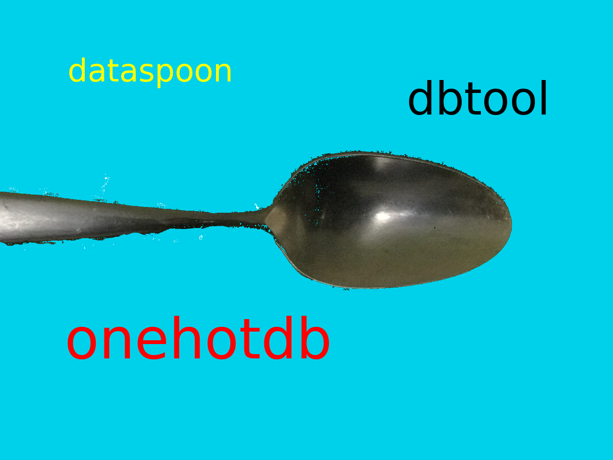

<!-- Improved compatibility of back to top link: See: https://github.com/othneildrew/Best-README-Template/pull/73 -->
<a name="readme-top"></a>
<!--
*** Thanks for checking out the Best-README-Template. If you have a suggestion
*** that would make this better, please fork the repo and create a pull request
*** or simply open an issue with the tag "enhancement".
*** Don't forget to give the project a star!
*** Thanks again! Now go create something AMAZING! :D
-->


<!-- PROJECT SHIELDS -->
<!--
*** I'm using markdown "reference style" links for readability.
*** Reference links are enclosed in brackets [ ] instead of parentheses ( ).
*** See the bottom of this document for the declaration of the reference variables
*** for contributors-url, forks-url, etc. This is an optional, concise syntax you may use.
*** https://www.markdownguide.org/basic-syntax/#reference-style-links
-->
[![Contributors][contributors-shield]][contributors-url]
[![Forks][forks-shield]][forks-url]
[![Stargazers][stars-shield]][stars-url]
[![Issues][issues-shield]][issues-url]
[![LinkedIn][linkedin-shield]][linkedin-url]

[](https://www.gnu.org/licenses/old-licenses/gpl-2.0.en.html)


# Why use dataspoon?


<!-- PROJECT LOGO -->
<br />
<div align="center">
  <a href="https://github.com/CentralFloridaAttorney/dbtool">
    
  </a>
<h3 align="center">dataspoon</h3>
  <p align="center">
    easy to use tools for working with data
    <br />
    <a href="https://github.com/CentralFloridaAttorney/dataspoon/wiki"><strong>Explore the Wiki»</strong></a>
    <br />
    <a href="https://github.com/CentralFloridaAttorney/dbtool">View Demo | </a>
    <a href="https://github.com/CentralFloridaAttorney/dbtool/issues">Report Bug | </a>
    <a href="https://github.com/CentralFloridaAttorney/dbtool/issues">Request Feature</a>
  </p>
</div>


<!-- TABLE OF CONTENTS -->
<details>
  <summary>Table of Contents</summary>
  <ol>
    <li>
      <a href="#about-the-project">About The Project</a>
      <ul>
        <li><a href="#built-with">Built With</a></li>

      </ul>
    </li>
    <li>
      <a href="#getting-started">Getting Started</a>
      <ul>
        <li><a href="#prerequisites">Prerequisites</a></li>
        <li><a href="#installation">Installation</a></li>
      </ul>
    </li>
    <li><a href="#usage">Usage</a></li>
    <li><a href="#roadmap">Roadmap</a></li>
    <li><a href="#contributing">Contributing</a></li>
    <li><a href="#license">License</a></li>
    <li><a href="#contact">Contact</a></li>
    <li><a href="#acknowledgments">Acknowledgments</a></li>
  </ol>
</details>


<!-- ABOUT THE PROJECT -->
## About The Project

<p align="right">(<a href="#readme-top">back to top</a>)</p>

### Built With


<p align="right">(<a href="#readme-top">back to top</a>)</p>

<!-- GETTING STARTED -->
## Getting Started With dataspoon

### dbtool helps you to eat more data

DBTool() allows you to create and modify MySQL databases using Python with simple get and put commands.

For example, you can set and get a key/value pair to ('ala'/'kazam') in a row that is referenced by the link_key ('xyzzy'):

````
DBTool().put('xyzzy', 'ala', 'kazam')
value = DBTool().get('xyzzy', 'ala')
````
To perform the same operation in a different database ('magicdb'):
````
DBTool('magicdb').put('xyzzy', 'ala', 'kazam')
value = DBTool('magicdb').get('xyzzy', 'ala')
````

### onehotdb makes data taste better


And, to perform the same operation in a different database ('magic_carpet') and a different table ('magic_table')
````
DBTool('magicdb', 'magic_table').put('xyzzy', 'ala', 'kazam')
value = DBTool('magicdb', 'magic_table').get('xyzzy', 'ala')
````


DBTool allows you to create and use MySQL databases in Python with simple get and put commands.
````
    def put(self, _link_key, _key_value=None, _value=None):
        # returns row_number of _link_key
        # 1 value: new_link_key
        # 2 value: old_link_key_value, new_link_key_value
        # 3 value: link_key, key, value
````


azxf


````
    xyzzydb = DBTool() creates a database named dBTool with table named default_table.
    xyzzydb = DBTool('xyzzydb') creates a database named xyzzydb with a table named default_table.
    xyzzydb = DBTool('xyzzydb', 'best_magic_table') creates a database named xyzzydb with a table named best_magic_table.
    xyzzydb.put('link_key_xyzzy') creates a row with link_key ('link_key_xyzzy')
    xyzzydb.put('link_key_xyzzy', 'revised_link_key_xyzzy') changes the link_key for link_key ('link_key_xyzzy') to link_key ('revised_link_key_xyzzy')
    xyzzydb.put('revised_link_key_xyzzy', 'ala', 'kazam') sets key ('ala') to value ('kazam') in row with link_key ('revised_link_key_xyzzy')
    
    1. Create a database ('xyzzydb', 'magic_table'): xyzzydb = DBTool('xyzzydb', 'magic_table').  The MySQL.table_name is a default name, unless you specify a table_name during creation (ex. xyzzydb = DBTool('xyzzydb', 'magic_table')) or after creation (ex. xyzzydb.open_table('new_magic_table'))
    2. Create a new record with a link_key ('link_key_xyzzy'): xyzzydb.put('link_key_xyzzy')
    3. Revise an existing link_key ('revised_link_key_xyzzy'): xyzzydb.put('link_key_xyzzy', 'revised_link_key_xyzzy')
    4. Put key/value ('ala'/'kazam') into row with link_key ('revised_link_key_xyzzy'): xyzzydb.put('revised_link_key_xyzzy', 'ala', 'kazam')
    5. Get this_value ('kazam') using key ('ala') from row with link_key value ('revised_link_key_xyzzy'): this_value = xyzzydb.get('revised_link_key_xyzzy', 'ala')
    6. Save xyzzydb.magic_table as a pandas.DataFrame .pkl file ('data/mysql.pkl'): xyzzydb.to_pickle('data/mysql.pkl')
````
### dbtool.OneHotWords()

onehotdb builds upon dBTool and instead of storing the value, onehotdb splits the value into smaller parts or words and stores the smaller parts in a database of words.  The indices to those words are stored in onehotdb.

### Prerequisites

1. Install MySQL:
````
sudo rm -rf /var/lib/mysql/mysql
sudo apt-get remove --purge mysql-server mysql-client mysql-common
sudo apt-get autoremove
sudo apt-get autoclean
sudo apt-get install mysql-server
````
2. Install mysql-connector-python:
````
pip install mysql-connector-python
````
3. Optionally, install mysql-workbench:
````
sudo aptitude install mysql-workbench-community
````

4. You need to know the location (ex. 127.0.0.1 or 192.168.1.69) and port number (ex. 3306 or 50011)
5. You must know the username (ex. 'bilbo') and password (ex. 'baggins') of an authorized user in mysql


### Installation

1. If you need help using dataspoon then [Talk to John](https://centralfloridaattorney.net/schedule-consultation/)
2. Clone the repo
   ```sh
   git clone https://github.com/CentralFloridaAttorney/dataspoon.git
   ```
3. No NPM packages to install
   ```sh
   NO npm install
   ```
4. Have fun!
   ````

<p align="right">(<a href="#readme-top">back to top</a>)</p>


<!-- USAGE EXAMPLES -->
## Usage

   
_For more examples, please refer to the [Documentation](https://example.com)_

<p align="right">(<a href="#readme-top">back to top</a>)</p>


<!-- ROADMAP -->
## Roadmap

- [ ] Feature 1
- [ ] Feature 2
- [ ] Feature 3
    - [ ] Nested Feature

See the [open issues](https://github.com/CentralFloridaAttorney/dbtool/issues) for a full list of proposed features (and known issues).

<p align="right">(<a href="#readme-top">back to top</a>)</p>


<!-- CONTRIBUTING -->
## Contributing

Contributions are what make the open source community such an amazing place to learn, inspire, and create. Any contributions you make are **greatly appreciated**.

If you have a suggestion that would make this better, please fork the repo and create a pull request. You can also simply open an issue with the tag "enhancement".
Don't forget to give the project a star! Thanks again!

1. Fork the Project
2. Create your Feature Branch (`git checkout -b feature/AmazingFeature`)
3. Commit your Changes (`git commit -m 'Add some AmazingFeature'`)
4. Push to the Branch (`git push origin feature/AmazingFeature`)
5. Open a Pull Request

<p align="right">(<a href="#readme-top">back to top</a>)</p>


<!-- LICENSE -->
## License


<p align="right">(<a href="#readme-top">back to top</a>)</p>


<!-- CONTACT -->
## Contact

Project Link: [https://github.com/CentralFloridaAttorney/dbtool](https://github.com/CentralFloridaAttorney/dbtool)

<p align="right">(<a href="#readme-top">back to top</a>)</p>


<!-- ACKNOWLEDGMENTS -->
## Acknowledgments

* []()
* []()
* []()

<p align="right">(<a href="#readme-top">back to top</a>)</p>

[![Product Name Screen Shot][product-screenshot]](https://CentralFloridaAttorney.net)


<!-- MARKDOWN LINKS & IMAGES -->
<!-- https://www.markdownguide.org/basic-syntax/#reference-style-links -->
[contributors-shield]: https://img.shields.io/github/contributors/CentralFloridaAttorney/dbtool.svg?style=for-the-badge
[contributors-url]: https://github.com/CentralFloridaAttorney/dbtool/graphs/contributors
[forks-shield]: https://img.shields.io/github/forks/CentralFloridaAttorney/dbtool.svg?style=for-the-badge
[forks-url]: https://github.com/CentralFloridaAttorney/dbtool/network/members
[stars-shield]: https://img.shields.io/github/stars/CentralFloridaAttorney/dbtool.svg?style=for-the-badge
[stars-url]: https://github.com/CentralFloridaAttorney/dbtool/stargazers
[issues-shield]: https://img.shields.io/github/issues/CentralFloridaAttorney/dbtool.svg?style=for-the-badge
[issues-url]: https://github.com/CentralFloridaAttorney/dbtool/issues
[license-shield]: https://img.shields.io/github/license/CentralFloridaAttorney/dbtool.svg?style=for-the-badge
[license-url]: https://github.com/CentralFloridaAttorney/dbtool/blob/master/LICENSE.txt
[linkedin-shield]: https://img.shields.io/badge/-LinkedIn-black.svg?style=for-the-badge&logo=linkedin&colorB=555
[linkedin-url]:https://www.linkedin.com/in/john-m-iriye-3136478
[product-screenshot]: images/dataspoon_project.png
[Next.js]: https://img.shields.io/badge/next.js-000000?style=for-the-badge&logo=nextdotjs&logoColor=white
[Next-url]: https://nextjs.org/
[React.js]: https://img.shields.io/badge/React-20232A?style=for-the-badge&logo=react&logoColor=61DAFB
[React-url]: https://reactjs.org/
[Vue.js]: https://img.shields.io/badge/Vue.js-35495E?style=for-the-badge&logo=vuedotjs&logoColor=4FC08D
[Vue-url]: https://vuejs.org/
[Angular.io]: https://img.shields.io/badge/Angular-DD0031?style=for-the-badge&logo=angular&logoColor=white
[Angular-url]: https://angular.io/
[Svelte.dev]: https://img.shields.io/badge/Svelte-4A4A55?style=for-the-badge&logo=svelte&logoColor=FF3E00
[Svelte-url]: https://svelte.dev/
[Laravel.com]: https://img.shields.io/badge/Laravel-FF2D20?style=for-the-badge&logo=laravel&logoColor=white
[Laravel-url]: https://laravel.com
[Bootstrap.com]: https://img.shields.io/badge/Bootstrap-563D7C?style=for-the-badge&logo=bootstrap&logoColor=white
[Bootstrap-url]: https://getbootstrap.com
[JQuery.com]: https://img.shields.io/badge/jQuery-0769AD?style=for-the-badge&logo=jquery&logoColor=white
[JQuery-url]: https://jquery.com 
